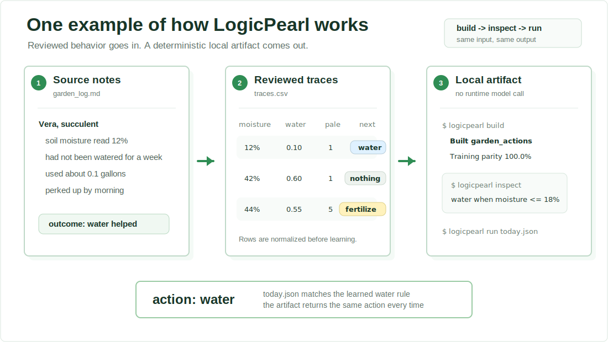
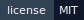
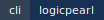
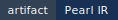

<p align="center">
  
</p>

# LogicPearl

**Turn reviewed decision examples into small, inspectable policy artifacts you can run, diff, and verify without calling an LLM.**

LogicPearl is for bounded decision logic that should be explicit instead of buried in services, scripts, prompts, spreadsheets, or conditional code.

Give it examples of normalized inputs and the decisions that came out. It builds a `pearl`: a deterministic artifact bundle with readable rules, stable JSON output, file hashes, and reviewable provenance.

The runtime does not call a model, spend tokens, or improvise. The same normalized input produces the same output every time.

```bash
logicpearl build examples/demos/garden_actions/traces.csv --action-column next_action --default-action do_nothing --gate-id garden_actions --output-dir /tmp/garden-actions
logicpearl inspect /tmp/garden-actions
logicpearl run /tmp/garden-actions examples/demos/garden_actions/today.json --explain
```

That builds a small action policy from reviewed garden-care examples, prints the learned rules, and runs today's input through the artifact. It does not invent domain data for you; it points at the example files in this repo so you can see and edit the traces yourself.

After running those commands, the artifact shape is:

```text
Built action artifact garden_actions
  Rows 16
  Actions water, do_nothing, fertilize, repot
  Default action do_nothing
  Training parity 100.0%

Action rules:
  1. water
     Soil Moisture at or below 18% and Water used in the last 7 days at or below 0.2
  2. fertilize
     Days since fertilized at or above 32.0
  3. repot
     Days since fertilized at or above 15.0 and Days since watered at or above Growth Cm Last 14 Days

action: water
reason:
  - Soil Moisture at or below 18% and Water used in the last 7 days at or below 0.2
```

<p align="center">
  <a href="./LICENSE"></a>
  <a href="./Cargo.toml"></a>
  <a href="./crates/logicpearl/Cargo.toml"></a>
  <a href="./schema"></a>
</p>

[Install](./docs/install.md) · [Docs](./docs/README.md) · [Core Loop](#core-loop) · [Where It Fits](#where-it-fits) · [What You Can Trust](#what-you-can-trust) · [Open Core](#open-core-policy) · [Roadmap](./ROADMAP.md) · [Benchmarks](./BENCHMARKS.md) · [Datasets](./DATASETS.md)

## Install

For release downloads, checksum verification, Homebrew, and source install details, see [docs/install.md](./docs/install.md). Prebuilt release bundles include `logicpearl` and `z3`; source installs need a solver such as `z3` on `PATH`.

To install from a cloned source checkout instead:

```bash
cargo install --path crates/logicpearl
```

That source path builds the CLI only. For discovery workflows, keep `z3` on your `PATH` or use the prebuilt bundle, which includes `z3`.

## Core Loop

```text
build -> inspect -> run -> verify -> diff
```

Clone the repository when you want the checked-in examples:

```bash
git clone https://github.com/LogicPearlHQ/logicpearl.git
cd logicpearl
```

Build a pearl from a checked-in action trace file:

```bash
logicpearl build examples/demos/garden_actions/traces.csv \
  --action-column next_action \
  --default-action do_nothing \
  --gate-id garden_actions \
  --output-dir /tmp/garden-actions
```

Inspect the learned logic:

```bash
logicpearl inspect /tmp/garden-actions
```

Run the artifact on a new input:

```bash
logicpearl run /tmp/garden-actions examples/demos/garden_actions/today.json --explain
logicpearl run /tmp/garden-actions examples/demos/garden_actions/today.json --json
```

Verify the artifact bundle:

```bash
logicpearl artifact inspect /tmp/garden-actions --json
logicpearl artifact digest /tmp/garden-actions
logicpearl artifact verify /tmp/garden-actions
```

That is the main path. A labeled behavior slice goes in; an inspectable deterministic artifact comes out.

More examples:

- [Garden actions demo](./examples/demos/garden_actions/README.md)
  Learn a multi-action artifact that chooses `water`, `fertilize`, `repot`, or `do_nothing`.
- [WAF edge demo](./examples/waf_edge/README.md)
  Run a pipeline that observes HTTP requests, evaluates grouped pearls, and routes to allow, deny, or review.
- [PII Shield](https://github.com/LogicPearlHQ/pii-shield)
  See a separate repo that wires LogicPearl into a Claude Code hook.

## What Gets Built

A build writes an artifact bundle:

- `artifact.json`
  Stable bundle manifest with schema version, artifact kind, engine version, IR version, file paths, and hashes.
- `pearl.ir.json`
  The deterministic decision artifact.
- `build_report.json`
  Build details, discovery summary, and generated file hashes.

The bundle directory is the normal CLI entrypoint:

```bash
logicpearl inspect /tmp/logicpearl-output
logicpearl run /tmp/logicpearl-output input.json
```

Python services can load the same artifact once and evaluate in-process:

```python
from logicpearl import LogicPearlEngine

engine = LogicPearlEngine.from_path("/tmp/logicpearl-output")
result = engine.evaluate({"age": 34, "is_member": True})
print(result["decision_kind"])
```

The runtime JSON has versioned schemas under [schema](./schema/), including gate, action, explanation, and artifact-error result shapes. See [docs/artifacts.md](./docs/artifacts.md) for the full bundle contract.

## Decision Traces

The simplest input is a CSV file where each row is an observed decision:

- feature columns describe the case
- one label column records the outcome

Example:

```csv
role,resource,after_hours,allowed
viewer,doc,false,true
viewer,admin_panel,false,false
editor,doc,true,true
```

By default, `logicpearl build` accepts `.csv`, `.jsonl` / `.ndjson`, and `.json` traces. JSON inputs can contain nested objects and arrays; LogicPearl flattens them into feature paths such as `account.age_days` or `claims.0.code`.

If your label column is not obvious, pass it explicitly:

```bash
logicpearl build traces.csv \
  --label-column allowed \
  --output-dir /tmp/pearl
```

If your trace file carries review-only columns, keep them in the source file and choose the feature set explicitly:

```bash
logicpearl build traces.csv \
  --feature-columns role,resource,after_hours \
  --output-dir /tmp/pearl

logicpearl build traces.csv \
  --exclude-columns source,note \
  --output-dir /tmp/pearl
```

When training parity is below 100%, ask LogicPearl to write a row-level
diagnostic report:

```bash
logicpearl build traces.csv \
  --show-conflicts \
  --output-dir /tmp/pearl
```

The report records the trace row hash, expected result, predicted result,
matched rules, rule-referenced feature values, and near-miss predicates. It is
an opt-in diagnostic sidecar, not part of the artifact's deterministic logic.

`logicpearl build` also reads `logicpearl.yaml` from the current directory:

```yaml
build:
  traces: traces.csv
  label_column: allowed
  exclude_columns:
    - source
    - note
  show_conflicts: true
  output_dir: output
```

For multi-action traces, use an action column:

```bash
logicpearl build traces.csv \
  --action-column next_action \
  --default-action do_nothing \
  --output-dir /tmp/actions
```

When "no learned rule matched" must be different from the business default,
use a no-match action:

```bash
logicpearl build traces.csv \
  --action-column decision \
  --default-action releasable \
  --no-match-action insufficient_context \
  --output-dir /tmp/actions
```

## Inspect, Improve, Diff

The point of the artifact is not just that it runs. The point is that the decision logic is visible enough to review.

Useful follow-up commands:

```bash
logicpearl inspect /tmp/logicpearl-output --json
logicpearl diff /tmp/old-pearl /tmp/new-pearl
logicpearl diff /tmp/old-pearl /tmp/new-pearl --json
```

If a rule looks wrong, improve the trace data or add maintained constraints, rebuild, and diff the artifact. The diff distinguishes raw logic changes from explanation-only changes when metadata is present.

For readable rule labels, pass a feature dictionary:

```bash
logicpearl build traces.csv \
  --feature-dictionary feature_dictionary.json \
  --output-dir /tmp/pearl
```

The dictionary affects generated labels, messages, counterfactual hints, `inspect`, and `diff`. It does not change runtime evaluation.

## Where It Fits

LogicPearl is for bounded decision logic that should behave like code, but be easier to review than a pile of nested `if` statements. It is useful when you already have reviewed behavior examples and want a deterministic artifact that can be inspected, versioned, and run locally.

Good fits:

- deep conditional logic spread across services, scripts, prompt branches, spreadsheets, or decision tables
- decisions where "why not?" matters as much as "what happened"
- eligibility, routing, approval, escalation, guardrail, compliance, and action-selection workflows
- counterfactual review: the smallest useful input change that would have changed the decision
- cases that need 100% repeatable evaluation on covered inputs, not statistically likely answers
- policy or document workflows where RAG is too probabilistic for the final decision step

RAG can be useful upstream for finding documents, extracting fields, or normalizing messy input. LogicPearl is a better fit for the final bounded decision when the requirement is "apply this reviewed rule behavior exactly, explain which rule fired, and diff any change before release."

| Tool                 | Best for                                  | LogicPearl difference                                                                      |
| -------------------- | ----------------------------------------- | ------------------------------------------------------------------------------------------ |
| Deep conditionals    | Application logic hidden across code paths | LogicPearl turns the behavior into a small artifact you can inspect, test, hash, and diff. |
| RAG over policy docs | Retrieval and open-ended answer synthesis | LogicPearl makes the final decision deterministically once inputs are normalized.          |
| OPA / Rego           | Hand-written policy                       | LogicPearl learns from reviewed traces, then emits inspectable artifacts.                  |
| Decision tables      | Manually maintained rules                 | LogicPearl builds, hashes, verifies, and diffs deployable bundles.                         |
| ML classifiers       | Statistical prediction                    | LogicPearl keeps runtime behavior deterministic and reviewable.                            |
| Prompts              | Flexible language reasoning               | LogicPearl does not call a model or improvise at runtime.                                  |

## What You Can Trust

A pearl is not a claim that the training data was perfect. It is a deterministic boundary around a reviewed behavior slice.

LogicPearl gives you:

- repeatable runtime evaluation for the same normalized input
- inspectable decision logic before deployment
- stable runtime JSON schemas
- artifact manifests and file hashes
- semantic diffs between artifact versions
- no telemetry, no analytics, and no runtime network requests from the CLI/runtime during normal use

AI can help create traces or normalize messy input before the pearl. The pearl itself is deterministic software.

## Further Docs

Most new users can stop after `build`, `inspect`, `run`, `artifact verify`, and `diff`. The deeper docs are organized by boundary:

- [Docs index](./docs/README.md)
  Start here when you need a specific integration or reference page.
- [Artifacts](./docs/artifacts.md)
  Bundle layout, manifests, schemas, digest, verify, and compile.
- [Provenance](./docs/provenance.md)
  Build provenance, source manifests, generated file hashes, and privacy posture.
- [Plugins](./docs/plugins.md)
  Observer, trace-source, enricher, and verifier plugins, including local-process trust boundaries.
- [Pipelines](./docs/pipelines.md)
  Multi-stage execution and layered override/pass pipelines.
- [Browser runtime](./docs/browser-runtime.md)
  Browser-safe Wasm evaluation through `@logicpearl/browser`.
- [Conformance](./docs/conformance.md)
  Runtime parity, formal spec checks, schema fixtures, and reproducibility receipts.
- [Development](./docs/development.md)
  Local checks, release readiness, packaging, and maintainer workflow.
- [Benchmarks](./BENCHMARKS.md) and [Datasets](./DATASETS.md)
  Public evidence, corpus hygiene, and reproducible scoring notes.

## Project Status

LogicPearl is a single-maintainer project at version 0.1.x. The core engine, CLI, runtime, artifact format, and schemas are MIT licensed.

The core is domain-agnostic. The examples exist to exercise the engine and show integration patterns; they are not special cases built into the core.

## Open Core Policy

The open-source core is the local artifact workflow:

- `logicpearl` CLI: build, inspect, run, diff, compile, and verify
- Rust crates for IR, runtime, engine loading, discovery, schemas, verification, plugins, pipelines, conformance, rendering, and benchmark adapters
- published artifact and runtime JSON schemas under [schema](./schema/)
- `@logicpearl/browser` for browser-safe evaluation of open artifact bundles
- checked-in examples, fixtures, benchmark protocols, and docs needed to reproduce public claims

Those pieces are MIT licensed and are intended to stay open. New functionality required to build, inspect, run, verify, diff, and reproduce local LogicPearl artifacts belongs in the open core.

Commercial tooling may exist around the core, but not replace it. Examples include hosted trace ingestion, team dashboards, hosted artifact registries, monitoring, review workflows, managed benchmark runs, and enterprise administration.

Telemetry and data posture:

- the local CLI and runtime do not call home during normal use
- no telemetry or analytics are collected by the local CLI/runtime
- hosted services, if offered, must document what data they receive, retain, and process
- customer traces, source manifests, plugin outputs, and artifact contents must not be used for training or benchmarking without explicit permission
- self-hosted and local artifact workflows must remain usable without a hosted account

Contributions are welcome. See [CONTRIBUTING.md](./CONTRIBUTING.md).

## Repository Layout

- `crates/logicpearl`
  User-facing CLI.
- `crates/logicpearl-*`
  Core Rust libraries for IR, runtime, discovery, pipelines, verification, rendering, conformance, and benchmark adaptation.
- `packages/logicpearl-browser`
  Browser runtime package for Wasm artifact bundles.
- `examples`
  Small runnable examples and demos.
- `benchmarks`
  Public benchmark corpora and parity examples.
- `fixtures`
  Tiny inspection and runtime inputs used by tests and examples.
- `schema`
  Published JSON schemas for public artifact formats.
- `docs`
  Topic docs for artifact contracts, provenance, plugins, pipelines, browser runtime, conformance, development, and advanced guides.

## Why Use LogicPearl

- replace brittle conditional logic with explicit artifacts
- inspect and diff deployable decision logic
- verify artifact integrity before use
- capture parity on bounded trace slices
- keep runtime evaluation compact and deterministic
- keep messy input handling outside the decision artifact
