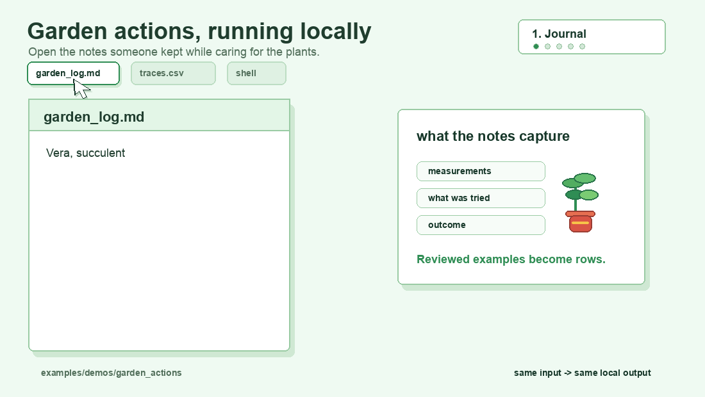

<p align="center">
  
</p>

# LogicPearl

**Given examples of what went in and what decision came out, LogicPearl builds deterministic decision logic you can inspect, run, diff, and improve.**

Every approval, denial, escalation, block, review flag, and exception path is policy, even when it is scattered across services, scripts, prompts, spreadsheets, and human workarounds.

If you have examples of what went in and what came out, you have enough to start:

- requests went in, approvals or denials came out
- tickets went in, escalation decisions came out
- prompts went in, moderation outcomes came out
- claims, access checks, risk reviews, or compliance cases went in, final decisions came out

LogicPearl does not ask you to hand-code a giant rule table. It learns or assembles the decision layer from data: whether someone can change a flight, whether a healthcare claim should be accepted or rejected and why, whether a patient appears eligible for a medical trial, whether an NPC should trust a player, whether a request should be escalated, or whether an AI output should be blocked.

That behavior becomes a `pearl`: a small deterministic artifact that runs the decision logic directly. You can inspect the reasons it uses, run it on new inputs, compare versions, catch weird inherited behavior, and improve the artifact with better examples.

For high-stakes workflows, that boundary matters. A RAG-backed LLM can retrieve papers or notes and still hallucinate the eligibility logic for a medical trial. With LogicPearl, messy extraction can stay at the edge, while the final fit/no-fit decision comes from a deterministic pearl with exact reasons and source references to the papers, criteria, or policy clauses that drove the result.

The direct use case is simple: feed LogicPearl the inputs and outputs from a legacy system, learn an artifact that matches that behavior, verify parity on the cases you care about, and replace the old coded decision path with something smaller, often faster, easier to understand, and easier to review.

At runtime, a pearl does not spend tokens and does not improvise. The same normalized input produces exactly the same output every time.

You do not have to replace your current system first. LogicPearl can start as an audit layer over decisions you already have. Build a pearl from observed inputs and outputs, see what decision logic it recovered, then decide whether to keep auditing, improve the traces, or eventually use the pearl directly.

If you do not have real traces yet, there is a second path: use an LLM to synthesize candidate examples, review them, and build a pearl from the accepted trace data. The garden actions demo shows that shape in a vivid, low-stakes setting.

Messy input stays at the edge. A parser, app, human review step, or LLM turns it into normalized features. The pearl runs the reusable decision logic without spending tokens, and its output is exactly repeatable.

LogicPearl does not require AI. AI is useful for generating examples, extracting features, and calling pearls inside larger workflows. The pearl itself is deterministic software you can inspect and version.

<p align="center">
  <a href="./LICENSE"></a>
  <a href="./Cargo.toml"></a>
  <a href="./crates/logicpearl/Cargo.toml"></a>
  <a href="./schema"></a>
</p>

[Website](https://logicpearl.com) · [Terminology](./TERMINOLOGY.md) · [Install](./docs/install.md) · [Start Here](#start-here) · [Garden Demo](#try-the-garden-demo) · [Why This Is Interesting](#why-this-is-interesting) · [Synthetic Traces](#generate-clean-synthetic-traces) · [What You Can Trust](#what-you-can-trust) · [Benchmarks](./BENCHMARKS.md) · [Datasets](./DATASETS.md) · [Advanced Guardrail Guide](./docs/advanced-guardrail-guide.md) · [Next Demos](#next-demos) · [Repository Layout](#repository-layout)

Quick runnable path with checked-in input/output traces:

```bash
curl -fsSL https://raw.githubusercontent.com/LogicPearlHQ/logicpearl/main/install.sh | sh
logicpearl build examples/getting_started/decision_traces.csv --output-dir /tmp/logicpearl-output
logicpearl inspect /tmp/logicpearl-output
logicpearl run /tmp/logicpearl-output examples/getting_started/new_input.json
```

That takes a tiny observed behavior slice and emits a reusable artifact bundle you can inspect, run, and improve.

New here? Read [Terminology](./TERMINOLOGY.md) first.

For a more compelling example with multiple features and non-obvious rules:

```bash
logicpearl trace examples/getting_started/synthetic_access_policy.tracegen.json --output /tmp/synthetic_traces.csv
logicpearl build /tmp/synthetic_traces.csv --output-dir /tmp/synthetic-pearl
logicpearl inspect /tmp/synthetic-pearl
```

This discovers three rules across five policy features — results you couldn't eyeball from the raw CSV.

## What LogicPearl Is

LogicPearl is not a place to hand-code a giant decision table. It is a way to replace complex conditional code with a bounded decision artifact created from behavior data.

The first win is visibility. Once behavior is a pearl, you can see the decision logic that is actually being applied. You can spot paths that look too broad, too narrow, or just wrong. Then you can add better examples, refine the feature dictionary, add maintained logic, rebuild, and diff the new artifact against the old one.

Parity is useful when you want to capture an existing behavior slice. But parity is not the ceiling. LogicPearl also gives you a practical loop for improving behavior because the decision logic is no longer buried in prompts, handlers, scripts, or scattered service code.

When the recovered artifact matches the behavior you need, it can become the replacement path: a compact evaluator with explicit decision logic instead of a legacy service, brittle script, long prompt, or scattered conditional maze.

You also do not have to replace your current system to get value. You can use LogicPearl as an audit layer: build a pearl from observed decisions, inspect the decision logic it recovered, compare the artifact against the current path, find surprising behavior, add better examples, and decide later whether any part should become the runtime path.

A pearl is decision logic packaged as a software artifact:
- inspectable
- diffable
- testable
- portable
- explainable
- compilable to WASM

The execution shape is simple:
1. messy real-world input stays at the edge
2. an observer maps it into normalized features
3. a pearl executes deterministic logic
4. the result can be inspected, validated, diffed, and deployed

The repository includes:
- Pearl IR and schemas
- observer and feature-contract tooling
- Rust runtime evaluation
- reproducible public demos
- bounded parity examples for external policy slices

## Start Here

If you are new, start with the public quickstart command.

Prerequisites:
- a supported macOS or Linux machine for the prebuilt installer
- a willingness to treat logic as a build artifact instead of application glue

Install the public CLI once, then ask it for the shortest runnable path:

```bash
curl -fsSL https://raw.githubusercontent.com/LogicPearlHQ/logicpearl/main/install.sh | sh
logicpearl quickstart
logicpearl quickstart build
```

Either command works — `quickstart` shows an interactive menu; `quickstart build` jumps directly to the build walkthrough.

The prebuilt installer:
- installs a versioned LogicPearl bundle under `~/.logicpearl`
- installs the `logicpearl` command into `~/.local/bin`
- keeps the default build path working without separate dependency setup

> **How discovery works:** `logicpearl build` uses an SMT solver (z3, bundled with the installer) to discover exact decision rules from your training data. A pure-Rust MIP fallback is available via `LOGICPEARL_SOLVER_BACKEND=mip`. The runtime evaluator is pure Rust with no external dependencies.

Full install details and manual bundle instructions live in [docs/install.md](./docs/install.md).

To run the checked-in getting-started example:

```bash
logicpearl build examples/getting_started/decision_traces.csv --output-dir /tmp/logicpearl-output
logicpearl inspect /tmp/logicpearl-output
logicpearl run /tmp/logicpearl-output examples/getting_started/new_input.json
```

The example paths in this README reference checked-in files under `examples/`, `fixtures/`, and `benchmarks/`. Those files are not bundled into the crates.io package.

To install from source instead of using the prebuilt bundle:

```bash
cargo install --path crates/logicpearl
```

For source builds, the equivalent form is:

```bash
cargo run --manifest-path Cargo.toml -p logicpearl -- <command>
```

Practical rule:
- the prebuilt installer is the easiest path for normal CLI usage
- `cargo install logicpearl` is the source-build path
- this README's file paths are repository-relative unless stated otherwise
- if you only installed from crates.io, point `logicpearl` at your own trace dataset or clone the repository for the checked-in examples
- `logicpearl quickstart` is the best first command when you are learning the surface

## Try The Garden Demo

The garden demo is the shortest way to see the sample without a pile of flags.

<p align="center">
  
</p>

Someone kept notes about what they tried with each plant and whether it helped:

```text
Vera, succulent
- soil moisture read 12%
- had not been watered for a week
- used about 0.1 gallons
- perked up by morning
```

After review, those notes become ordinary traces with measurements and a `next_action` column:

- [garden notes](./examples/demos/garden_actions/garden_log.md)
- [garden action traces](./examples/demos/garden_actions/traces.csv)

Build and inspect the action artifact:

```bash
cd examples/demos/garden_actions
logicpearl build
logicpearl inspect
```

Run it on a new plant check:

```bash
logicpearl run today.json --explain
```

Expected shape:

```text
action: water
reason:
  - Soil Moisture at or below 18% and Water used in the last 7 days at or below 0.2
```

The demo uses `logicpearl.yaml`, so the command stays short. LogicPearl generates readable feature metadata from the trace columns by default and emits one action policy artifact with action-labeled rules. The point is not that LogicPearl is a plant expert. The point is that reviewed examples can become a small deterministic artifact that returns the next action and the reason.

After you inspect the artifact, you can improve it: add edge cases, remove weak examples, make feature labels clearer, rebuild, and compare the result. That improvement loop is the point.

When you need deployables for the same action policy, build with `--compile`:

```bash
logicpearl build --compile
```

That emits a native runner and, if the local Wasm target is installed, `pearl.wasm` plus `pearl.wasm.meta.json`.

## Build A Pearl From Decision Traces

Start with a tiny labeled behavior slice:

- [decision_traces.csv](./examples/getting_started/decision_traces.csv)

Each example is an observed decision:
- input features
- final outcome in the `allowed` column

Now build a pearl from those examples:

```bash
logicpearl build examples/getting_started/decision_traces.csv --output-dir examples/getting_started/output
```

What you should see:
- a named artifact directory at `examples/getting_started/output`
- one artifact bundle you can treat as the entrypoint for CLI usage
- `artifact.json`, `pearl.ir.json`, and `build_report.json`

For CLI usage, the important bit is:
- the bundle directory or `artifact.json` is the logical artifact
- native binaries and wasm modules are optional deployable derivatives
- `logicpearl run` executes the artifact bundle directly

If you want deployable binaries, compile them explicitly after the bundle exists:

The default native compile path is same-host and self-contained: it copies the
installed LogicPearl runner and embeds the pearl payload, so a prebuilt CLI
install is enough. Wasm compile and non-host `--target` builds still shell out to
`cargo build --offline --release`; those paths require Rust/Cargo, locally
cached Cargo dependencies, and any requested Rust target or linker/toolchain.

```bash
logicpearl compile examples/getting_started/output
logicpearl compile examples/getting_started/output --target wasm32-unknown-unknown
```

The wasm artifact is intentionally split when compiled:
- `*.pearl.wasm` is a tiny compiled evaluator
- `*.pearl.wasm.meta.json` is the wasm metadata file with bit-to-rule metadata, messages, and counterfactual hints

For JavaScript and browser integrations, the public surface is the official loader/runtime package.
Frontend code should not call raw Wasm exports directly.

The package surface is:

```js
import { loadArtifact } from '@logicpearl/browser';

const artifact = await loadArtifact('/artifacts/authz');
const result = artifact.evaluate(input);
```

That runtime layer is responsible for:
- Wasm loading
- feature-slot packing
- `BigInt` bitmask decoding
- wasm metadata lookup
- returning fired rules and hints in a browser-friendly shape

By default, `build` accepts labeled decision traces in `.csv`, `.jsonl` / `.ndjson`, or `.json` form. These inputs are normalized decision traces, not raw messy operational records: every row must flatten to the same scalar feature set, CSV cells must be non-empty, and JSON nulls, empty arrays, empty objects, bare root scalars, and ragged row schemas are rejected. Normalize missing or optional source data in an observer, `trace_source` plugin, or adapter before discovery.

For JSON inputs, nested objects and arrays are flattened into dotted feature paths such as `account.age_days` or `claims.0.code`.

It also infers the binary label column when there is one unambiguous candidate and normalizes common human-formatted scalar values such as:
- `$95,000` -> `95000`
- `22%` -> `0.22`
- `Yes` / `No` -> `true` / `false`

If your dataset uses a different or ambiguous label column, pass `--label-column <name>`. If the label values are binary but not semantically obvious, pass `--default-label <value>` or `--rule-label <value>`.

Alternative input examples:

```bash
logicpearl build examples/demos/loan_approval/traces.jsonl --output-dir /tmp/loan-jsonl
logicpearl build examples/demos/content_moderation/traces_nested.json --output-dir /tmp/mod-nested
```

The public builder can recover multi-condition deny slices and records the selection details in `build_report.json`. That keeps the artifact compact without hiding the final `deny_when` logic.

Additional build controls:
- `--refine` tightens uniquely over-broad rules
- `--pinned-rules rules.json` merges a maintained rule layer after discovery
- `--feature-dictionary feature_dictionary.json` gives raw feature IDs readable labels, states, and source anchors
- `--feature-governance governance.json` constrains how discovery may use specific features
- `--raw-feature-ids` skips the default generated feature metadata

Example:

```bash
logicpearl build examples/getting_started/decision_traces.csv --output-dir /tmp/logicpearl-build --refine
```

### Make learned logic readable with a feature dictionary

LogicPearl learns deterministic decision logic from feature IDs. A feature dictionary tells LogicPearl what those features mean before discovery runs, so generated artifact text, `inspect`, and `diff` are readable without changing runtime behavior.

When no dictionary is passed, `logicpearl build` generates starter feature metadata from the trace column names. Pass a dictionary when feature IDs are stable machine names but the artifact should speak in domain language, carry state-specific text, or include source anchors:

```bash
logicpearl build traces.csv \
  --feature-dictionary feature_dictionary.json \
  --output-dir /tmp/logicpearl-build
```

Dictionary entries are embedded into the emitted `pearl.ir.json` under `input_schema.features[].semantics`. The raw rule expression stays visible and remains the source of deterministic truth:

```json
{
  "deny_when": {
    "feature": "requirement__req-003__satisfied",
    "op": "<=",
    "value": 0.0
  },
  "label": "Failed conservative therapy is missing"
}
```

The dictionary is generic. Do not encode healthcare, payer, or policy-specific parsing in the LogicPearl core. Domain adapters should generate the dictionary alongside traces and pass it to `build` or `discover`; CSV users can start with labels only and add state text when they want higher-quality diffs.

See [Feature dictionaries](./docs/feature-dictionary.md) for the schema, examples, and guidance for integration authors.

### Constrain one-sided evidence with feature governance

Some signals only mean something when they appear.

Examples:
- `contains_xss_signature == true` can be a reason to block
- `contains_xss_signature == false` is usually not a reason to allow or deny
- `likely_benign_request == true` may be useful for routing or audit, but should not become a deny rule

If you let discovery treat every boolean feature both ways, it can learn nonsense from quirks in the data instead of real policy. The fix is not to blacklist one bad learned rule after the fact. The fix is to tell LogicPearl what kind of signal it is allowed to use.

LogicPearl supports that through `--feature-governance`:

```bash
logicpearl build traces.jsonl \
  --output-dir /tmp/pearl \
  --feature-governance benchmarks/waf/prep/feature_governance.waf_v1.json
```

That governance file is just JSON. For boolean features, the most important control is whether deny evidence is:
- `either`
- `true_only`
- `false_only`
- `never`

When should you use it?

- Use `true_only` when `true` is meaningful but `false` mostly means "not observed"
- Use `never` when the feature is just context, bookkeeping, or a weak hint
- Leave it as `either` when you would be comfortable writing both directions as a real human policy rule

Rule of thumb:

- pattern detections, signatures, alerts, and analyst flags are usually one-sided
- request-shape fields and weak context hints usually should not become deny rules on their own
- if you would never write "absence of this signal means danger" as a policy rule, do not let discovery learn that inversion

The WAF example uses this to mark features like `contains_sqli_signature` and `meta_reports_xss` as one-sided positive signals, while bookkeeping features like `request_has_body`, `request_has_query`, `contains_quote`, and `likely_benign_request` are not allowed to become deny rules.

If you are not sure where to start, ask LogicPearl to suggest a governance file from your traces:

```bash
logicpearl traces audit traces.jsonl --write-feature-governance /tmp/feature_governance.json
```

That suggestion pass is conservative. It uses feature names, types, and audit context to produce a starter file you can review, not hidden automatic policy.

### Generate clean synthetic traces

If you want LogicPearl to learn from synthetic behavior instead of a checked-in dataset, start from a declarative trace-generation spec:

- [synthetic_access_policy.tracegen.json](./examples/getting_started/synthetic_access_policy.tracegen.json)

Synthetic traces can also come from an LLM during setup, as long as you treat the model as a trace author, not as the runtime decision maker.

The plant demo uses that shape:
- ask an LLM to enumerate realistic plant-care checks from a written watering policy
- normalize each check into gate-ready features such as `normal_plant_dry_enough`, `succulent_ready_for_water`, `drooping_from_dryness`, and `hot_window_dried_out`
- label each example with `water_now` or `wait`
- review and audit the generated trace data
- build a pearl from the accepted traces

At runtime, an LLM or deterministic parser can read a new plant-care message, emit the normalized feature object, and call the pearl. The agent no longer has to spend tokens re-deciding the watering policy on every request, and the reusable logic remains inspectable.

Generate traces:

```bash
logicpearl traces generate examples/getting_started/synthetic_access_policy.tracegen.json --output /tmp/synthetic_access_policy.jsonl
```

Audit the result for nuisance-feature leakage:

```bash
logicpearl traces audit /tmp/synthetic_access_policy.jsonl --spec examples/getting_started/synthetic_access_policy.tracegen.json
```

Then build from the generated traces exactly like any other dataset:

```bash
logicpearl build /tmp/synthetic_access_policy.jsonl --output-dir /tmp/synthetic_access_policy
```

The important boundary is:
- policy fields can drive the generated label through declarative deny rules
- nuisance fields are sampled independently and then audited for label skew
- discovery still runs on the emitted traces, not on hidden handwritten runtime logic
- optional feature dictionaries can make generated rule labels and diffs read like the source policy
- optional feature governance can further constrain one-sided evidence if some generated features should only be usable in one direction

Inspect the artifact:

```bash
logicpearl inspect examples/getting_started/output
```

Run it on a new input:

```bash
logicpearl run examples/getting_started/output examples/getting_started/new_input.json
cat examples/getting_started/new_input.json | logicpearl run examples/getting_started/output -
```

Both `logicpearl run` and `logicpearl pipeline run` also accept omitted input paths and will read JSON from stdin in that case.

Optionally compile it into a standalone native executable, then run the compiled
binary. This is not required for normal artifact evaluation; `logicpearl run`
executes the artifact bundle directly.

The default native compile path is same-host and self-contained: it copies the
installed LogicPearl runner and embeds the pearl payload, so it does not require
Rust/Cargo. Wasm compile and non-host `--target` builds still shell out to
`cargo build --offline --release`; those paths require Rust/Cargo, locally
cached Cargo dependencies, and any requested Rust target or linker/toolchain.

```bash
logicpearl compile examples/getting_started/output
./examples/getting_started/output/decision_traces.pearl examples/getting_started/new_input.json
```

You can also recompile for specific platforms by Rust target triple:

```bash
logicpearl compile examples/getting_started/output --name authz-demo --target x86_64-unknown-linux-gnu
logicpearl compile examples/getting_started/output --name authz-demo --target x86_64-pc-windows-msvc
logicpearl compile examples/getting_started/output --name authz-demo --target aarch64-apple-darwin
logicpearl compile examples/getting_started/output --name authz-demo --target wasm32-unknown-unknown
```

For cross-target builds, install the Rust target first with `rustup target add <target-triple>`, and make sure any required linker/toolchain is available on your machine.

That is the simplest LogicPearl loop:
- observed behavior goes in
- a pearl comes out
- the artifact is inspectable
- the runtime is deterministic

If you want to drive LogicPearl from Python or another language, prefer the stable artifact and CLI boundary rather than reaching into Rust internals directly:

```bash
logicpearl build examples/getting_started/decision_traces.csv --output-dir /tmp/logicpearl-build --json
```

The same stage model is available to plugins:
- `observer` plugins map messy input into normalized features
- `trace_source` plugins emit decision traces for discovery
- `enricher` plugins transform records before artifact emission
- `verify` plugins annotate proof or audit status

Process plugins are trusted local code. A plugin manifest declares a program to execute, and plugin-backed builds, observers, verifiers, benchmark runs, and pipelines run those programs on your machine. Do not run plugin or pipeline manifests from sources you do not trust. By default, process plugins run with a timeout and without arbitrary PATH or absolute-entrypoint resolution; only relax those defaults with `--allow-no-timeout`, `--allow-absolute-plugin-entrypoint`, or `--allow-plugin-path-lookup` for manifests you trust.

Plugin manifest `input_schema`, `options_schema`, and `output_schema` fields use a LogicPearl schema subset, not full JSON Schema. Supported validation keywords are `type`, `const`, `enum`, `required`, `properties`, `items`, and `additionalProperties`; `title`, `description`, `$schema`, and `$id` are accepted as annotations only. Unsupported JSON Schema keywords such as `minimum`, `maximum`, `pattern`, `oneOf`, `anyOf`, `allOf`, `$ref`, and `format` are rejected instead of silently ignored.

### Custom plugins and observer profiles

The intended boundary is:
- the generic core owns artifact formats, discovery/runtime plumbing, validation, and compilation
- observer artifacts and plugins own domain meaning

If your domain has its own raw input shape, keep that meaning at the edge instead of forcing it into the shared core. Native observer profiles define schemas and generic matching behavior; cue text such as guardrail phrase seeds lives in observer artifact data, for example [benchmarks/guardrails/observers/guardrails_v1.seed.json](./benchmarks/guardrails/observers/guardrails_v1.seed.json).

If you are building custom boundaries, the advanced surfaces live here:
- `logicpearl plugin validate` / `logicpearl plugin run` for contract debugging
- `logicpearl observer ...` for observer profiles and scaffolds
- `logicpearl build ... --trace-plugin-manifest ...` for build-time trace plugins
- `logicpearl pipeline ...` for plugin-backed stage execution
- `logicpearl conformance ...` for manifests, runtime parity, and spec verification

Start with:
- [Advanced guardrail guide](./docs/advanced-guardrail-guide.md)
- [WAF edge demo](./examples/waf_edge/README.md)

### Validate and run a string-of-pearls pipeline artifact

Public product language: a string of pearls.

Executable artifact language: a `pipeline.json`.

Validate the checked-in example:

```bash
logicpearl pipeline validate examples/pipelines/authz/pipeline.json
logicpearl pipeline inspect examples/pipelines/authz/pipeline.json
logicpearl pipeline run examples/pipelines/authz/pipeline.json examples/pipelines/authz/input.json
cat examples/pipelines/authz/input.json | logicpearl pipeline run examples/pipelines/authz/pipeline.json -
logicpearl pipeline trace examples/pipelines/authz/pipeline.json examples/pipelines/authz/input.json --json
```

What you should see:
- the pipeline manifest is valid
- the pipeline structure is inspectable
- the pearl stage executes and produces final pipeline output
- the trace command emits the full stage-by-stage execution record
- stage exports and `@stage.export` references are internally consistent

Plugin-backed stages can run too. For example, observer -> pearl:

```bash
logicpearl pipeline run examples/pipelines/observer_membership/pipeline.json examples/pipelines/observer_membership/input.json --json
```

That runs a Python observer plugin at the edge, exports normalized features, then feeds them into a deterministic pearl.

And you can keep going into a verification/audit stage:

```bash
logicpearl pipeline run examples/pipelines/observer_membership_verify/pipeline.json examples/pipelines/observer_membership_verify/input.json --json
```

That gives you a full public chain:
- observer plugin
- deterministic pearl
- verify plugin

`trace_source` is now a first-class pipeline stage too. Use `payload` when the plugin input is not naturally an object, and `options` when the plugin needs explicit config instead of smuggling it through a string:

```json
{
  "id": "trace_source",
  "kind": "trace_source_plugin",
  "plugin_manifest": "../../plugins/python_trace_source/manifest.json",
  "payload": "$.source",
  "options": {
    "label_column": "$.label_column"
  },
  "export": {
    "decision_traces": "$.decision_traces"
  }
}
```

That is generic core plumbing, not domain logic:
- `payload` carries the stage input
- `options` carries stage configuration
- the plugin still owns domain interpretation

### Run a pearl in under a minute

```bash
logicpearl inspect fixtures/ir/valid/auth-demo-v1.json
logicpearl diff fixtures/ir/valid/auth-demo-v1.json fixtures/ir/valid/auth-demo-v1.json
logicpearl run fixtures/ir/valid/auth-demo-v1.json fixtures/ir/eval/auth-demo-v1-deny-multiple-rules-input.json
```

What you should see:
- a deterministic evaluation result
- a compact artifact summary
- a semantic diff path that does not treat raw bit reordering as the main event
- behavior that is explicit instead of buried in service code

That small output shows the core shape:
- small artifact
- deterministic runtime
- explicit reasons
- behavior that does not disappear into service code

## What You Can Trust

A pearl is not a black box and it is not a claim that the training data was perfect.

What LogicPearl gives you is specific and useful:

- the same normalized input produces the same output every time
- the emitted decision logic can be inspected before you ship it
- bad inherited behavior can be surfaced instead of silently copied
- new examples can be added to steer the next artifact
- artifact diffs can show whether logic changed or only explanation text changed
- examples, specs, and benchmarks can travel with the artifact as evidence
- AI can help create traces or read messy inputs, but the pearl itself does not improvise

That means a garden-actions pearl is only as good as the reviewed plant-care examples behind it. A claims, access, or compliance pearl is only as good as the traces, policy sources, review process, and verification checks behind it.

The important shift is that reusable decision logic becomes explicit. You can inspect it, test it, diff it, and decide whether the evidence is strong enough for your use case.

## Which Surface To Use

Use the surface that matches where the logic actually runs:

- `logicpearl`
  - for humans
  - shell workflows
  - build/inspect/run/diff from a terminal

- `logicpearl-engine`
  - for application backends and services
  - when you want to load a pearl or pipeline once and execute it repeatedly in-process
  - when your workflow uses plugins, files, or server-side adapters

- `logicpearl` Python package
  - for Python code that needs the real Rust execution surface
  - thin bindings over `logicpearl-engine`, not a CLI subprocess wrapper
  - lives under [`reserved-python/logicpearl`](./reserved-python/logicpearl)

- `@logicpearl/browser`
  - for browser-safe evaluation only
  - best when the executed path is really a pearl or browser-safe bundle running client-side

Practical rule:
- if it needs plugins, Python, files, secrets, or server-only adapters, use `logicpearl-engine`
- if your app is in Python, use the `logicpearl` Python package as the bridge to `logicpearl-engine`
- if it is truly browser-safe, use `@logicpearl/browser`
- if a person is driving it from the terminal, use `logicpearl`

## Advanced Integrations

Most new users can stop after `build`, `inspect`, `run`, and `pipeline`.

If you are building custom boundaries or proof workflows, start here:
- [Advanced guardrail guide](./docs/advanced-guardrail-guide.md)
- [WAF edge demo](./examples/waf_edge/README.md)
- [OPA / Rego parity example](./benchmarks/opa_rego/README.md)

Representative advanced commands:

```bash
logicpearl plugin validate examples/plugins/python_observer/manifest.json
logicpearl observer run --plugin-manifest examples/plugins/python_observer/manifest.json --input examples/plugins/python_observer/raw_input.json
logicpearl build --trace-plugin-manifest examples/plugins/python_trace_source/manifest.json --trace-plugin-input examples/getting_started/decision_traces.csv --trace-plugin-option label_column=allowed --output-dir /tmp/output
logicpearl conformance runtime-parity examples/getting_started/output examples/getting_started/decision_traces.csv --label-column allowed
```

### See the bitmask visually

See example outputs:
- [Auth Bitmask SVG](./docs/examples/auth-bitmask.svg)
- [Auth Heatmap SVG](./docs/examples/auth-heatmap.svg)

<p align="center">
  
  
</p>

## Why This Is Interesting

Most real decision logic ends up as one of these:
- a giant conditional blob
- conditionals spread across services
- brittle policy code no one wants to touch
- AI extraction with no deterministic boundary after it

LogicPearl is a different shape:
- raw input stays outside the pearl
- normalized features cross a clear boundary
- the pearl itself is deterministic
- the output is compact, portable, and explainable
- the decision paths become visible enough to review and improve

The point is not another place to hand-code if/else logic.
The point is a new execution shape for decision logic.

You can use that shape to match an existing system, but you can also use it to make the behavior better. When a pearl exposes an awkward decision path, a missing case, or a confusing label, you have something concrete to change: the traces, the feature contract, the dictionary, or the maintained rule layer. Then `diff` shows what actually changed.

That means LogicPearl can start as an audit tool:
- learn a readable artifact from current decisions
- inspect what the current behavior appears to be doing
- find places where the existing behavior is inconsistent or undesirable
- improve the trace set or rule layer
- keep the old system running until you are ready to use the pearl directly

And in research workflows, the same idea can move even earlier: use a pearl during model training to clean or weight training examples. For example, a model may land on the right math answer for the wrong reason. A LogicPearl gate can flag those "lucky correct" examples with readable rules, so the training loop can prefer cleaner reasoning instead of blindly learning from every correct-looking answer. After each training round, you can generate new model outputs, build a new pearl from the model's current failure modes, and use that updated gate in the next round.

How to compare it to familiar tools:
- A rules engine or decision table gives you a place to write rules. LogicPearl focuses on the artifact lifecycle around a bounded behavior slice: build or layer decision logic, inspect it, diff it, validate parity, and deploy the resulting artifact.
- OPA/Rego is a strong choice when you want to author and run policy directly. LogicPearl is useful when you want to recover or package a slice from traces, existing behavior, synthetic examples, or adapter output, then keep the result as a compact deterministic artifact.
- A model prompt can reason about a case once. A pearl captures the reusable part of that reasoning as explicit logic an app or agent can call repeatedly.
- A decision tree or classifier may explain a dataset. A pearl is meant to be a reviewed runtime boundary with stable inputs, rule metadata, semantic diffs, and optional compiled deployables.

When artifacts change over time, the important question is:
- which rule was added
- which rule was removed
- which rule changed meaning

That is why `logicpearl diff` compares artifacts semantically instead of treating raw bit positions as the source of truth.

The old shape is:
- logic hidden in applications
- changes made by editing fragile mazes
- review done indirectly
- production behavior inferred after the fact

The LogicPearl shape is:
- behavior compiled into artifacts
- semantic boundaries between observation and evaluation
- deterministic runtime outputs
- artifacts that can be inspected, diffed, versioned, and transported

That is why this matters.

If a system controls approvals, money, access, policy, risk, or compliance, then “the code runs somewhere” is not a satisfying model anymore.

And the full promise is broader than “write rules in JSON”:
- start from behavior, examples, or an existing policy/runtime
- generate the artifact in the middle
- keep the final pearl deterministic and portable
- keep the observer boundary explicit instead of burying it in application code

## More Guides

Additional guides:

- [Garden actions demo](./examples/demos/garden_actions/README.md) for the notes -> reviewed traces -> next-action artifact loop
- [Advanced guardrail guide](./docs/advanced-guardrail-guide.md) for the full observer -> traces -> artifact-set workflow
- [WAF edge demo](./examples/waf_edge/README.md) for raw-request plugins and route mapping
- [OPA / Rego parity example](./benchmarks/opa_rego/README.md) for a smaller bounded policy-parity walkthrough
- [BENCHMARKS.md](./BENCHMARKS.md) and [DATASETS.md](./DATASETS.md) for the public benchmark story and local staging expectations

## What You Can Do Here

- inspect and validate `pearl.ir.json` artifacts
- diff two artifacts semantically, even when rule bits moved
- run pearls through the Rust runtime
- compile small pearls to WASM
- reproduce the garden actions demo
- reproduce the auth demo
- run a smaller OPA / Rego parity example
- structure guardrail benchmarks with clean `train / dev / post-freeze external evaluation` separation
- see how observer specs and feature contracts connect raw inputs to pearls
- inspect the generated artifact chain instead of treating the pearl as a black box

## Benchmarks

The benchmark summary lives in [BENCHMARKS.md](./BENCHMARKS.md).

That file covers:
- the current guardrail corpus story
- held-out development results
- what the current public benchmark numbers do and do not prove

The separate OPA / Rego parity example lives in [benchmarks/opa_rego/README.md](./benchmarks/opa_rego/README.md).

## Next Demos

### Garden Actions Demo

A small trace-synthesis demo showing how reviewed journal-style notes can become a reusable `water` / `fertilize` / `repot` / `do_nothing` artifact.

See:
- [examples/demos/garden_actions/README.md](./examples/demos/garden_actions/README.md)

### Auth Demo

A compact artifact-first demo for learning the pearl format and runtime shape.

```bash
logicpearl inspect fixtures/ir/valid/auth-demo-v1.json
logicpearl run fixtures/ir/valid/auth-demo-v1.json '{"role": "viewer", "resource": "doc"}'
```

See: [fixtures/ir/valid/auth-demo-v1.json](./fixtures/ir/valid/auth-demo-v1.json)

### WAF Demo

A full raw-request WAF demo showing:

- custom observer plugins for domain semantics
- classic WAF request classes like SQLi, restricted-resource access, and automation probes
- a collective route pearl for `allow`, `deny`, and `review`

See:
- [examples/waf_edge/README.md](./examples/waf_edge/README.md)

### OPA / Rego Example

A smaller bounded parity example that starts from a fixed Rego policy, generates labeled traces with `opa`, and builds a LogicPearl artifact bundle from that slice.

See:
- [benchmarks/opa_rego/README.md](./benchmarks/opa_rego/README.md)

## Project Status

LogicPearl is a single-maintainer project at version 0.1.x. The core engine is fully open-source under MIT and will stay that way — there are no plans to relicense, dual-license, or restrict the open-source engine. A hosted evaluation service may exist in the future, but the CLI, the runtime, the discovery engine, and the artifact format are the open-source core and will not be gated behind a paid tier.

The fixtures include conformance contracts derived from real domain work (healthcare prior authorization, revenue recovery) — these domains motivate the engine design but the engine itself is domain-agnostic. There is no telemetry, no analytics, and no network calls in this tool.

Contributions are welcome. See [CONTRIBUTING.md](./CONTRIBUTING.md).

## Repository Layout

The repository is organized around one primary Rust-first surface:

- `crates/logicpearl`
  The user-facing CLI published as `logicpearl`.
- `crates/logicpearl-*`
  Core public libraries for IR, runtime, discovery, observers, pipelines, verification, rendering, conformance, and benchmark adaptation.
- `packages/`
  JavaScript-facing public packages, including the browser runtime for Wasm artifact bundles.
- `examples/`
  Small public examples and demos you can actually run.
- `benchmarks/`
  Public benchmark corpora, adapters, and benchmark-specific docs.
- `fixtures/`
  Tiny inspection and runtime inputs used by examples and tests.
- `schema/`
  Published JSON schemas for public artifact formats.
- `scripts/`
  Supporting scripts and reference tooling. The Rust CLI remains the primary interface.
- `docs/`
  Longer-form public guides and background material.
- `reserved-crates/`
  Namespace placeholder crates reserved for separately published modules. Ignore these unless you are working on package publishing.

The main directories are:
- `crates/logicpearl`
- `packages/logicpearl-browser`
- `examples/`
- `benchmarks/`
- `fixtures/`
- `schema/`

## Reproducible Artifacts

The public demos write real artifacts you can inspect:
- `artifact.json`
- `pearl.ir.json` for binary gates or multi-action artifacts
- `build_report.json`
- optional compiled native binaries when you run `logicpearl compile` or build an action policy with `--compile`
- optional compiled `.wasm` modules when you compile for `wasm32-unknown-unknown` or build an action policy with `--compile` and have the Wasm target installed

The core promise is simple:
- you should be able to build, run, inspect, and validate pearls yourself

## Why Use LogicPearl

- replace brittle conditional logic with explicit artifacts
- inspect and diff deployable decision logic
- demonstrate parity on a bounded trace slice, and prove stronger claims only when an explicit verification workflow is present
- keep runtime evaluation compact and portable
- pair human-readable specs with deployable runtime artifacts
- keep a clean boundary between messy input handling and deterministic logic
