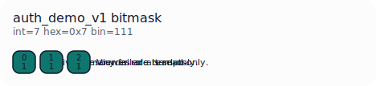
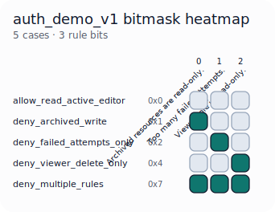

<p align="center">
  
</p>

# LogicPearl

**LogicPearl** turns hard software behavior into deterministic deployable artifacts called `pearls`.

If your system makes consequential decisions about policy, eligibility, trust, compliance, claims, approvals, or risk, LogicPearl gives you a way to move that logic into a bounded artifact: messy input stays at the edge, observers normalize it, pearls run deterministic logic, and the result becomes something you can inspect, diff, validate, compile, and deploy.

Many systems accumulate decision logic across handlers, services, scripts, and one-off edge cases. LogicPearl is built to extract a slice of that behavior into something smaller, testable, easier to understand, and parity-checkable against the existing path.

LogicPearl does not require AI. The artifact model stands on its own. AI can help extract messy inputs, build observers, synthesize artifacts, and call pearls inside larger workflows, but the runtime contract remains deterministic.

The goal is straightforward: learn or author an important behavior slice once, distill it into a pearl, then run and validate that artifact directly instead of rebuilding the same logic on every call.

<p align="center">
  <a href="./LICENSE"></a>
  <a href="./Cargo.toml"></a>
  <a href="./crates/logicpearl/Cargo.toml"></a>
  <a href="./schema"></a>
</p>

New here? Read [Terminology](./TERMINOLOGY.md) first.

[Website](https://logicpearl.com) · [Terminology](./TERMINOLOGY.md) · [Install](./docs/install.md) · [Start Here](#start-here) · [Why This Is Interesting](#why-this-is-interesting) · [Synthetic Traces](#generate-clean-synthetic-traces) · [Benchmarks](./BENCHMARKS.md) · [Datasets](./DATASETS.md) · [Advanced Guardrail Guide](./docs/advanced-guardrail-guide.md) · [Next Demos](#next-demos) · [Repository Layout](#repository-layout)

Quick proof path with the checked-in example files:

```bash
curl -fsSL https://raw.githubusercontent.com/LogicPearlHQ/logicpearl/main/install.sh | sh
logicpearl build examples/getting_started/decision_traces.csv --output-dir /tmp/logicpearl-output
```

That command takes a small labeled behavior slice and turns it into a deployable artifact bundle you can inspect and run locally.

## What LogicPearl Is

LogicPearl is not just a rules engine. It is a way to compile important behavior into bounded artifacts instead of hiding that behavior inside application code.

A pearl is logic as software artifact:
- inspectable
- diffable
- testable
- portable
- explainable
- compilable to WASM

The execution shape is simple:
1. messy real-world input stays at the edge
2. an observer maps it into normalized features
3. a pearl executes deterministic logic
4. the result can be inspected, validated, diffed, and deployed

The repository includes:
- Pearl IR and schemas
- observer and feature-contract tooling
- Rust runtime evaluation
- reproducible public demos
- bounded parity examples for external policy slices

## Which Surface To Use

Use the surface that matches where the logic actually runs:

- `logicpearl`
  - for humans
  - shell workflows
  - build/inspect/run/diff from a terminal

- `logicpearl-engine`
  - for application backends and services
  - when you want to load a pearl or pipeline once and execute it repeatedly in-process
  - when your workflow uses plugins, files, or server-side adapters

- `logicpearl` Python package
  - for Python code that needs the real Rust execution surface
  - thin bindings over `logicpearl-engine`, not a CLI subprocess wrapper
  - lives under [`reserved-python/logicpearl`](./reserved-python/logicpearl)

- `@logicpearl/browser`
  - for browser-safe evaluation only
  - best when the executed path is really a pearl or browser-safe bundle running client-side

Practical rule:
- if it needs plugins, Python, files, secrets, or server-only adapters, use `logicpearl-engine`
- if your app is in Python, use the `logicpearl` Python package as the bridge to `logicpearl-engine`
- if it is truly browser-safe, use `@logicpearl/browser`
- if a person is driving it from the terminal, use `logicpearl`

## Start Here

If you are new, start with the public quickstart command.

Prerequisites:
- a supported macOS or Linux machine for the prebuilt installer
- a willingness to treat logic as a build artifact instead of application glue

Install the public CLI and bundled Z3 once, then ask it for the shortest proof path:

```bash
curl -fsSL https://raw.githubusercontent.com/LogicPearlHQ/logicpearl/main/install.sh | sh
logicpearl quickstart
logicpearl quickstart build
```

The prebuilt installer:
- installs a versioned LogicPearl bundle under `~/.logicpearl`
- installs `logicpearl` and `z3` symlinks into `~/.local/bin`
- keeps the default build path working without separate solver setup

Full install details and manual bundle instructions live in [docs/install.md](./docs/install.md).

To run the checked-in getting-started example:

```bash
logicpearl build examples/getting_started/decision_traces.csv --output-dir /tmp/logicpearl-output
logicpearl inspect /tmp/logicpearl-output
logicpearl run /tmp/logicpearl-output examples/getting_started/new_input.json
```

The example paths in this README reference checked-in files under `examples/`, `fixtures/`, and `benchmarks/`. Those files are not bundled into the crates.io package.

To install from source instead of using the prebuilt bundle:

```bash
cargo install --path crates/logicpearl
```

For source builds, the equivalent form is:

```bash
cargo run --manifest-path Cargo.toml -p logicpearl -- <command>
```

Practical rule:
- the prebuilt installer is the easiest path for normal CLI usage
- `cargo install logicpearl` is the source-build path
- this README's file paths are repository-relative unless stated otherwise
- if you only installed from crates.io, point `logicpearl` at your own trace dataset or clone the repository for the checked-in examples
- `logicpearl quickstart` is the best first command when you are learning the surface

### Build a pearl from decision traces

Start with a tiny labeled behavior slice:

- [decision_traces.csv](./examples/getting_started/decision_traces.csv)

Each row is an observed decision:
- input features
- final outcome in the `allowed` column

Now emit a pearl with no hand-written rules:

```bash
logicpearl build examples/getting_started/decision_traces.csv --output-dir examples/getting_started/output
```

What you should see:
- a named artifact directory at `examples/getting_started/output`
- one artifact bundle you can treat as the entrypoint for CLI usage
- `artifact.json`, `pearl.ir.json`, and `build_report.json`

For end users, the important rule is:
- the bundle directory or `artifact.json` is the logical artifact
- native binaries and wasm modules are optional deployable derivatives
- `logicpearl run` executes the artifact bundle directly

If you want deployable binaries, compile them explicitly after the bundle exists:

```bash
logicpearl compile examples/getting_started/output
logicpearl compile examples/getting_started/output --target wasm32-unknown-unknown
```

The wasm artifact is intentionally split when compiled:
- `*.pearl.wasm` is a tiny compiled evaluator
- `*.pearl.wasm.meta.json` is the wasm metadata file with bit-to-rule metadata, messages, and counterfactual hints

For JavaScript and browser integrations, the public surface is the official loader/runtime package.
Frontend code should not call raw Wasm exports directly.

The package surface is:

```js
import { loadArtifact } from '@logicpearl/browser';

const artifact = await loadArtifact('/artifacts/authz');
const result = artifact.evaluate(input);
```

That runtime layer is responsible for:
- Wasm loading
- feature-slot packing
- `BigInt` bitmask decoding
- wasm metadata lookup
- returning fired rules and hints in a browser-friendly shape

By default, `build` accepts labeled decision traces in `.csv`, `.jsonl` / `.ndjson`, or `.json` form. For JSON inputs, nested objects and arrays are flattened into dotted feature paths such as `account.age_days` or `claims.0.code`.

It also infers the binary label column when there is one unambiguous candidate and normalizes common human-formatted scalar values such as:
- `$95,000` -> `95000`
- `22%` -> `0.22`
- `Yes` / `No` -> `true` / `false`

If your dataset uses a different or ambiguous label column, pass `--label-column <name>`. If the label values are binary but not semantically obvious, pass `--positive-label <value>` or `--negative-label <value>`.

Alternative input examples:

```bash
logicpearl build examples/demos/loan_approval/traces.jsonl --output-dir /tmp/loan-jsonl
logicpearl build examples/demos/content_moderation/traces_nested.json --output-dir /tmp/mod-nested
```

The public builder already includes solver-backed conjunction recovery for multi-condition deny slices.

Additional build controls:
- `--refine` tightens uniquely over-broad rules
- `--pinned-rules rules.json` merges a maintained rule layer after discovery
- `--feature-governance governance.json` constrains how discovery may use specific features

Example:

```bash
logicpearl build examples/getting_started/decision_traces.csv --output-dir /tmp/logicpearl-build --refine
```

### Constrain one-sided evidence with feature governance

Some signals only mean something when they appear.

Examples:
- `contains_xss_signature == true` can be a reason to block
- `contains_xss_signature == false` is usually not a reason to allow or deny
- `likely_benign_request == true` may be useful for routing or audit, but should not become a deny rule

If you let discovery treat every boolean feature both ways, it can learn nonsense from quirks in the data instead of real policy. The fix is not to blacklist one bad learned rule after the fact. The fix is to tell LogicPearl what kind of signal it is allowed to use.

LogicPearl supports that through `--feature-governance`:

```bash
logicpearl build traces.jsonl \
  --output-dir /tmp/pearl \
  --feature-governance benchmarks/waf/prep/feature_governance.waf_v1.json
```

That governance file is just JSON. For boolean features, the most important control is whether deny evidence is:
- `either`
- `true_only`
- `false_only`
- `never`

When should you use it?

- Use `true_only` when `true` is meaningful but `false` mostly means "not observed"
- Use `never` when the feature is just context, bookkeeping, or a weak hint
- Leave it as `either` when you would be comfortable writing both directions as a real human policy rule

Rule of thumb:

- pattern detections, signatures, alerts, and analyst flags are usually one-sided
- request-shape fields and weak context hints usually should not become deny rules on their own
- if you would never write "absence of this signal means danger" as a policy rule, do not let discovery learn that inversion

The WAF example uses this to mark features like `contains_sqli_signature` and `meta_reports_xss` as one-sided positive signals, while bookkeeping features like `request_has_body`, `request_has_query`, `contains_quote`, and `likely_benign_request` are not allowed to become deny rules.

If you are not sure where to start, ask LogicPearl to suggest a governance file from your traces:

```bash
logicpearl traces audit traces.jsonl --write-feature-governance /tmp/feature_governance.json
```

That suggestion pass is conservative. It uses feature names, types, and audit context to produce a starter file you can review, not hidden automatic policy.

### Generate clean synthetic traces

If you want LogicPearl to learn from synthetic behavior instead of a checked-in dataset, start from a declarative trace-generation spec:

- [synthetic_access_policy.tracegen.json](./examples/getting_started/synthetic_access_policy.tracegen.json)

Generate traces:

```bash
logicpearl traces generate examples/getting_started/synthetic_access_policy.tracegen.json --output /tmp/synthetic_access_policy.jsonl
```

Audit the result for nuisance-feature leakage:

```bash
logicpearl traces audit /tmp/synthetic_access_policy.jsonl --spec examples/getting_started/synthetic_access_policy.tracegen.json
```

Then build from the generated traces exactly like any other dataset:

```bash
logicpearl build /tmp/synthetic_access_policy.jsonl --output-dir /tmp/synthetic_access_policy
```

The important boundary is:
- policy fields can drive the generated label through declarative deny rules
- nuisance fields are sampled independently and then audited for label skew
- discovery still runs on the emitted traces, not on hidden handwritten runtime logic
- optional feature governance can further constrain one-sided evidence if some generated features should only be usable in one direction

Inspect the artifact:

```bash
logicpearl inspect examples/getting_started/output
```

Run it on a new input:

```bash
logicpearl run examples/getting_started/output examples/getting_started/new_input.json
cat examples/getting_started/new_input.json | logicpearl run examples/getting_started/output -
```

Both `logicpearl run` and `logicpearl pipeline run` also accept omitted input paths and will read JSON from stdin in that case.

Compile it into a standalone native executable, then run the compiled binary:

```bash
logicpearl compile examples/getting_started/output
./examples/getting_started/output/decision_traces.pearl examples/getting_started/new_input.json
```

You can also recompile for specific platforms by Rust target triple:

```bash
logicpearl compile examples/getting_started/output --name authz-demo --target x86_64-unknown-linux-gnu
logicpearl compile examples/getting_started/output --name authz-demo --target x86_64-pc-windows-msvc
logicpearl compile examples/getting_started/output --name authz-demo --target aarch64-apple-darwin
logicpearl compile examples/getting_started/output --name authz-demo --target wasm32-unknown-unknown
```

For cross-target builds, install the Rust target first with `rustup target add <target-triple>`, and make sure any required linker/toolchain is available on your machine.

That is the simplest LogicPearl loop:
- observed behavior goes in
- a pearl comes out
- the artifact is inspectable
- the runtime is deterministic

If you want to drive LogicPearl from Python or another language, prefer the stable artifact and CLI boundary rather than reaching into Rust internals directly:

```bash
logicpearl build examples/getting_started/decision_traces.csv --output-dir /tmp/logicpearl-build --json
```

The same stage model is available to plugins:
- `observer` plugins map messy input into normalized features
- `trace_source` plugins emit decision traces for discovery
- `enricher` plugins transform records before artifact emission
- `verify` plugins annotate proof or audit status

Process plugins are trusted local code. A plugin manifest declares a program to execute, and plugin-backed builds, observers, verifiers, benchmark runs, and pipelines run those programs on your machine. Do not run plugin or pipeline manifests from sources you do not trust. By default, process plugins run with a timeout and without arbitrary PATH or absolute-entrypoint resolution; only relax those defaults with `--allow-no-timeout`, `--allow-absolute-plugin-entrypoint`, or `--allow-plugin-path-lookup` for manifests you trust.

### Custom plugins and observer profiles

The intended boundary is:
- the generic core owns artifact formats, discovery/runtime plumbing, validation, and compilation
- observer profiles and plugins own domain meaning

If your domain has its own raw input shape, keep that meaning at the edge instead of forcing it into the shared core.

If you are building custom boundaries, the advanced surfaces live here:
- `logicpearl plugin validate` / `logicpearl plugin run` for contract debugging
- `logicpearl observer ...` for observer profiles and scaffolds
- `logicpearl build ... --trace-plugin-manifest ...` for build-time trace plugins
- `logicpearl pipeline ...` for plugin-backed stage execution
- `logicpearl conformance ...` for manifests, runtime parity, and spec verification

Start with:
- [Advanced guardrail guide](./docs/advanced-guardrail-guide.md)
- [WAF edge demo](./examples/waf_edge/README.md)

### Validate and run a string-of-pearls pipeline artifact

Public product language: a string of pearls.

Executable artifact language: a `pipeline.json`.

Validate the checked-in example:

```bash
logicpearl pipeline validate examples/pipelines/authz/pipeline.json
logicpearl pipeline inspect examples/pipelines/authz/pipeline.json
logicpearl pipeline run examples/pipelines/authz/pipeline.json examples/pipelines/authz/input.json
cat examples/pipelines/authz/input.json | logicpearl pipeline run examples/pipelines/authz/pipeline.json -
logicpearl pipeline trace examples/pipelines/authz/pipeline.json examples/pipelines/authz/input.json --json
```

What you should see:
- the pipeline manifest is valid
- the pipeline structure is inspectable
- the pearl stage executes and produces final pipeline output
- the trace command emits the full stage-by-stage execution record
- stage exports and `@stage.export` references are internally consistent

Plugin-backed stages can run too. For example, observer -> pearl:

```bash
logicpearl pipeline run examples/pipelines/observer_membership/pipeline.json examples/pipelines/observer_membership/input.json --json
```

That runs a Python observer plugin at the edge, exports normalized features, then feeds them into a deterministic pearl.

And you can keep going into a verification/audit stage:

```bash
logicpearl pipeline run examples/pipelines/observer_membership_verify/pipeline.json examples/pipelines/observer_membership_verify/input.json --json
```

That gives you a full public chain:
- observer plugin
- deterministic pearl
- verify plugin

`trace_source` is now a first-class pipeline stage too. Use `payload` when the plugin input is not naturally an object, and `options` when the plugin needs explicit config instead of smuggling it through a string:

```json
{
  "id": "trace_source",
  "kind": "trace_source_plugin",
  "plugin_manifest": "../../plugins/python_trace_source/manifest.json",
  "payload": "$.source",
  "options": {
    "label_column": "$.label_column"
  },
  "export": {
    "decision_traces": "$.decision_traces"
  }
}
```

That is generic core plumbing, not domain logic:
- `payload` carries the stage input
- `options` carries stage configuration
- the plugin still owns domain interpretation

### Run a pearl in under a minute

```bash
logicpearl inspect fixtures/ir/valid/auth-demo-v1.json
logicpearl diff fixtures/ir/valid/auth-demo-v1.json fixtures/ir/valid/auth-demo-v1.json
logicpearl run fixtures/ir/valid/auth-demo-v1.json fixtures/ir/eval/auth-demo-v1-deny-multiple-rules-input.json
```

What you should see:
- a deterministic evaluation result
- a compact artifact summary
- a semantic diff path that does not treat raw bit reordering as the main event
- behavior that is explicit instead of buried in service code

That small output shows the core shape:
- small artifact
- deterministic runtime
- explicit reasons
- behavior that does not disappear into service code

### Advanced integrations

Most new users can stop after `build`, `inspect`, `run`, and `pipeline`.

If you are building custom boundaries or proof workflows, start here:
- [Advanced guardrail guide](./docs/advanced-guardrail-guide.md)
- [WAF edge demo](./examples/waf_edge/README.md)
- [OPA / Rego parity example](./benchmarks/opa_rego/README.md)

Representative advanced commands:

```bash
logicpearl plugin validate examples/plugins/python_observer/manifest.json
logicpearl observer run --plugin-manifest examples/plugins/python_observer/manifest.json --input examples/plugins/python_observer/raw_input.json
logicpearl build --trace-plugin-manifest examples/plugins/python_trace_source/manifest.json --trace-plugin-input examples/getting_started/decision_traces.csv --trace-plugin-option label_column=allowed --output-dir /tmp/output
logicpearl conformance runtime-parity examples/getting_started/output examples/getting_started/decision_traces.csv --label-column allowed
```

### See the bitmask visually

See example outputs:
- [Auth Bitmask SVG](./docs/examples/auth-bitmask.svg)
- [Auth Heatmap SVG](./docs/examples/auth-heatmap.svg)

<p align="center">
  
  
</p>

## Why This Is Interesting

Most real decision logic ends up as one of these:
- a giant rules blob
- conditionals spread across services
- brittle policy code no one wants to touch
- AI extraction with no deterministic boundary after it

LogicPearl is a different shape:
- raw input stays outside the pearl
- normalized features cross a clear boundary
- the pearl itself is deterministic
- the output is compact, portable, and explainable

The point is not “yet another rules engine.”
The point is a new execution shape for decision logic.

When artifacts change over time, the important question is:
- which rule was added
- which rule was removed
- which rule changed meaning

That is why `logicpearl diff` compares artifacts semantically instead of treating raw bit positions as the source of truth.

The old shape is:
- logic hidden in applications
- changes made by editing fragile mazes
- review done indirectly
- production behavior inferred after the fact

The LogicPearl shape is:
- behavior compiled into artifacts
- semantic boundaries between observation and evaluation
- deterministic runtime outputs
- artifacts that can be inspected, diffed, versioned, and transported

That is why this matters.

If software controls approvals, money, access, policy, risk, or compliance, then “the code runs somewhere” is not a satisfying model anymore.

And the full promise is broader than “write rules in JSON”:
- start from behavior, examples, or an existing policy/runtime
- generate the artifact in the middle
- keep the final pearl deterministic and portable
- keep the observer boundary explicit instead of burying it in application code

## More Guides

Additional guides:

- [Advanced guardrail guide](./docs/advanced-guardrail-guide.md) for the full observer -> traces -> artifact-set workflow
- [WAF edge demo](./examples/waf_edge/README.md) for raw-request plugins and route mapping
- [OPA / Rego parity example](./benchmarks/opa_rego/README.md) for a smaller bounded policy-parity walkthrough
- [BENCHMARKS.md](./BENCHMARKS.md) and [DATASETS.md](./DATASETS.md) for the public benchmark story and local staging expectations

## What You Can Do Here

- inspect and validate `pearl.ir.json` artifacts
- diff two artifacts semantically, even when rule bits moved
- run pearls through the Rust runtime
- compile small pearls to WASM
- reproduce the auth demo
- run a smaller OPA / Rego parity example
- structure guardrail benchmarks with clean `train / dev / post-freeze external evaluation` separation
- see how observer specs and feature contracts connect raw inputs to pearls
- inspect the generated artifact chain instead of treating the pearl as a black box

## Benchmarks

The benchmark summary lives in [BENCHMARKS.md](./BENCHMARKS.md).

That file covers:
- the current guardrail corpus story
- held-out development results
- what the current public benchmark numbers do and do not prove

The separate OPA / Rego parity example lives in [benchmarks/opa_rego/README.md](./benchmarks/opa_rego/README.md).

## Next Demos

### Auth Demo

A compact artifact-first demo for learning the pearl format and runtime shape.

### WAF Demo

A full raw-request WAF demo showing:

- custom observer plugins for domain semantics
- classic WAF request classes like SQLi, restricted-resource access, and automation probes
- a collective route pearl for `allow`, `deny`, and `review`

See:
- [examples/waf_edge/README.md](./examples/waf_edge/README.md)

### OPA / Rego Example

A smaller bounded parity example that starts from a fixed Rego policy, generates labeled traces with `opa`, and builds a LogicPearl artifact bundle from that slice.

See:
- [benchmarks/opa_rego/README.md](./benchmarks/opa_rego/README.md)

## Repository Layout

The repository is organized around one primary Rust-first surface:

- `crates/logicpearl`
  The user-facing CLI published as `logicpearl`.
- `crates/logicpearl-*`
  Core public libraries for IR, runtime, discovery, observers, pipelines, verification, rendering, conformance, and benchmark adaptation.
- `packages/`
  JavaScript-facing public packages, including the browser runtime for Wasm artifact bundles.
- `examples/`
  Small public examples and demos you can actually run.
- `benchmarks/`
  Public benchmark corpora, adapters, and benchmark-specific docs.
- `fixtures/`
  Tiny inspection and runtime inputs used by examples and tests.
- `schema/`
  Published JSON schemas for public artifact formats.
- `scripts/`
  Supporting scripts and reference tooling. The Rust CLI remains the primary interface.
- `docs/`
  Longer-form public guides and background material.
- `reserved-crates/`
  Namespace placeholder crates reserved for separately published modules. Ignore these unless you are working on package publishing.

The main directories are:
- `crates/logicpearl`
- `packages/logicpearl-browser`
- `examples/`
- `benchmarks/`
- `fixtures/`
- `schema/`

## Reproducible Artifacts

The public demos write real artifacts you can inspect:
- `artifact.json`
- `pearl.ir.json`
- `build_report.json`
- optional compiled native binaries when you run `logicpearl compile`
- optional compiled `.wasm` modules when you compile for `wasm32-unknown-unknown`

The core promise is simple:
- you should be able to build, run, inspect, and validate pearls yourself

## Why Use LogicPearl

- replace brittle logic blobs with explicit artifacts
- inspect and diff deployable decision logic
- prove parity on a bounded policy slice
- keep runtime evaluation compact and portable
- pair human-readable specs with deployable runtime artifacts
- keep a clean boundary between messy input handling and deterministic logic
